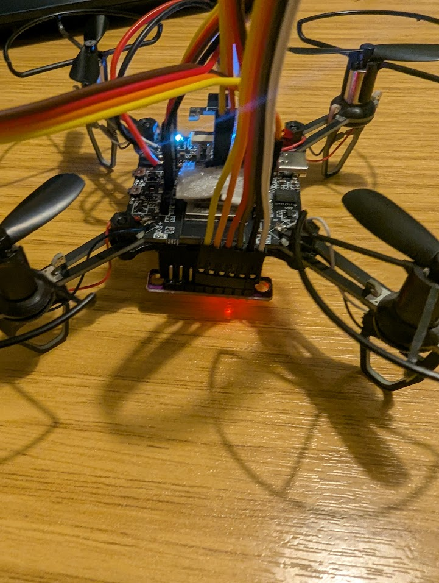
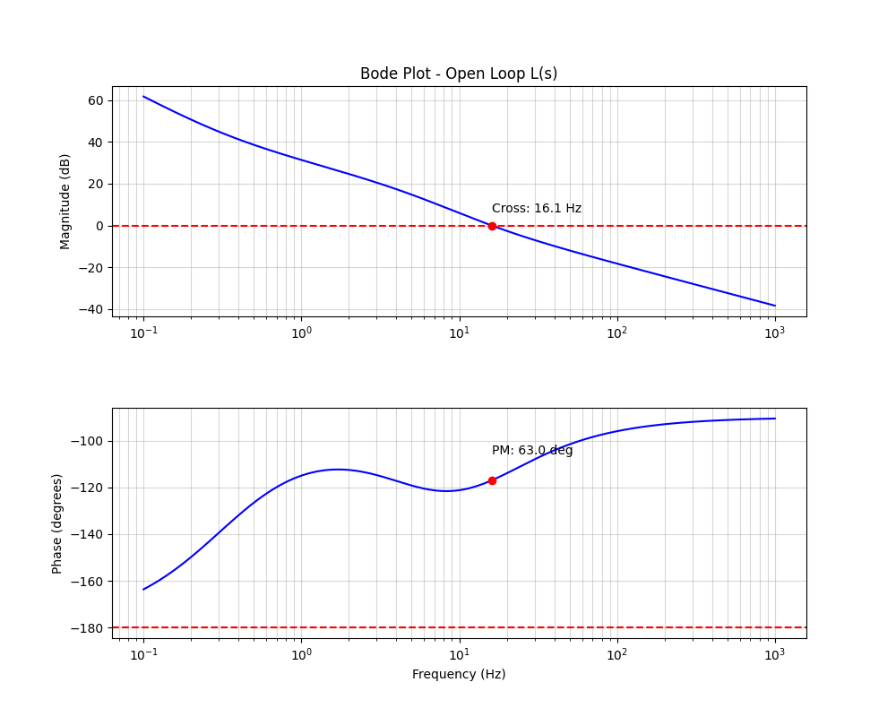
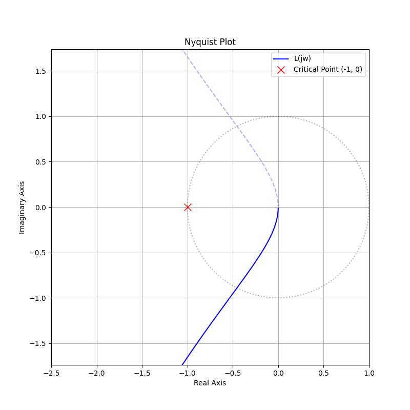

# ESP32 Drone Flight Controller

[](LICENSE)

A flight controller software stack written in C/C++ for the ESP32 microcontroller.



**Author:** Krystian Filipek

## Features

*   High-Speed Control Loop: Runs a stable 1000Hz (1ms) PID loop.
*   Cascaded PID Architecture:
    *   Outer Loop: Angle Control (Levelling modes).
    *   Inner Loop: Rate Control (Acro/Gyro stabilisation).
    *   Anti-Windup: Smart integral limits to prevent saturation.
*   State Estimation: 6-axis Kalman Filter fusing MPU6050 Gyroscope and Accelerometer data.
*   Motor Drive: High-resolution 12-bit PWM at 15kHz (LEDC hardware timer) for smooth motor response using standard MOS driver circuits.
*   Connectivity:
    *   WebSocket server for low-latency control commands ([Website](https://krystianfilipek.com)), can be controlled from anywhere.
    *   Python-based telemetry logger (`collect_telemetry.py`) for analysis
*   Safety: Low-throttle startup protection and fail-safe logic.

## Technical Specifications

| Parameter | Value | Details |
| :--- | :--- | :--- |
| MCU | ESP32-S2-Mini
| Loop Frequency | 1 kHz | 1ms Loop Time (Task Priority 5) |
| Sensor Protocol | I2C | 400kHz Fast-Mode |
| PWM Output | 15 kHz | 12-bit Resolution (4096 steps) |
| Control Interface | WebSocket | JSON Protocol (Roll/Pitch/Yaw/Throttle) |
| Frame Type | Quad-X | Standard mixing |

### System Architecture

The system relies on FreeRTOS to handle real-time constraints on the single-core ESP32-S2:
1.  Flight Task (Priority 5, High): Reads sensors $\rightarrow$ Kalman Filter $\rightarrow$ PID Calculations $\rightarrow$ Motor Mixing $\rightarrow$ PWM Output.
2.  WiFi/Comm Task (Lower Priority): Handles asynchronous web traffic, parses incoming control packets and queues them for the flight task.

## Telemetry & Analysis

The project includes a Python telemetry tool (`collect_telemetry.py`) that connects to the drone wirelessly. It captures:
*   Orientation (Roll, Pitch, Yaw)
*   Raw Sensor Data (Gyro XYZ, Accel XYZ)
*   Motor Outputs (M1-M4)
*   Battery Voltage
*   Current PID Terms (for tuning)

Usage:
```bash
python collect_telemetry.py
```

## Getting Started

### Prerequisites
*   [ESP-IDF v5.x](https://docs.espressif.com/projects/esp-idf/en/latest/esp32/get-started/)
*   Python 3.10+ (for telemetry script)

### Build Instructions

1.  **Clone the repository:**
    ```bash
    git clone https://github.com/kfilipekk/drone-esp32.git
    cd drone-esp32
    ```

2.  **Configure ESP-IDF:**
    ```bash
    idf.py set-target esp32
    idf.py menuconfig
    ```

3.  **Build & Flash:**
    ```bash
    idf.py build
    idf.py flash monitor
    ```

## Hardware Requirements

*   Flight Controller: ESP32 Development Board (I'm using the ESP-drone standard ESP-32-S2-Mini)
*   IMU: MPU6050 (GY-521 Breakout).
*   Propulsion: 4x Coreless Brushed Motors (716) OR Brushless motors with ESCs.
*   Driver: 4x MOSFETs (e.g., SI2302) if using brushed motors directly.
*   Power: 1S (3.7V) LiPo Battery.

## Applications

I developed this project to:
*   Practice Real-Time Operating Systems (RTOS) on embedded targets.
*   Implement complex control theory (Cascaded PID) from scratch.
*   Understand sensor fusion mathematics (Kalman Filtering) safely.
*   Bridge low-level hardware control with high-level web technologies.

## Control Loop Analysis

To verify the stability of the inner rate loop, a frequency domain analysis was performed based on the experimental tuning values and the physical model of a drone with 716 coreless motors ($46mm$ props).

### Methodology
The system was modeled as a cascaded control loop where:

1. Controller $C(s)$
Derived from the PID code ($K_p=250, K_i=500, K_d=2.5$) and output scaling ($S = 100/65535$):
$$
C(s) = \left( K_p + \frac{K_i}{s} + K_d s \right) \cdot S = \frac{0.0038 s^2 + 0.381 s + 0.763}{s}
$$

2. Plant $P(s)$
Estimated for a 30g quadcopter with 716 motors ($\tau \approx 30ms$) and high torque authority ($K \approx 600$):
$$
P(s) = \frac{K_{plant}}{s(\tau s + 1)} = \frac{600}{0.03s^2 + s}
$$

### Results
The theoretical stability margins indicate a highly stable but agile tune:

| Metric | Value | Comment |
| :--- | :--- | :--- |
| Phase Margin (PM) | 63.0° | Excellent stability (Ideal is $45^\circ$-$60^\circ$). Minimal overshoot expected. |
| Crossover Frequency | 16.1 Hz | Responsive bandwidth. Fast disturbance rejection without inducing high-frequency oscillation. |

### Visualisation

#### Bode Plot


#### Nyquist Diagram


### Practical Tuning Guide

| Parameter | To improve certain characteristics | Effect on Stability (PM) | Effect on Agility | Physical Symptom if too high |
| :--- | :--- | :--- | :--- | :--- |
| $K_p$ (Proportional) | Increase for sharpness | Decreases (Less stable) | Increases | Fast oscillation / shaking |
| $K_d$ (Derivative) | Increase for "locked-in" stops | Increases (More stable) | Neutral/Dampening | Hot motors / Screeching noise |
| $K_i$ (Integral) | Increase for stiffness | Decreases (Adds Lag) | Neutral | Slow wobbles / Bounce back |


